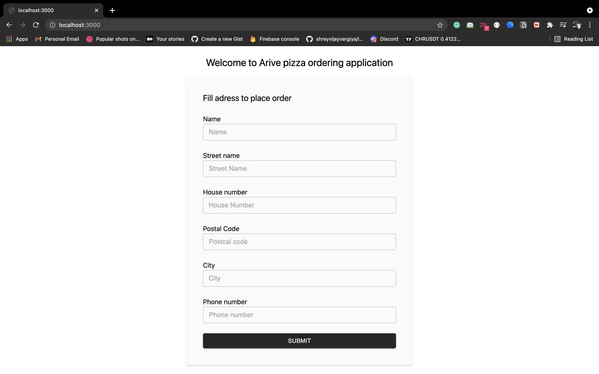
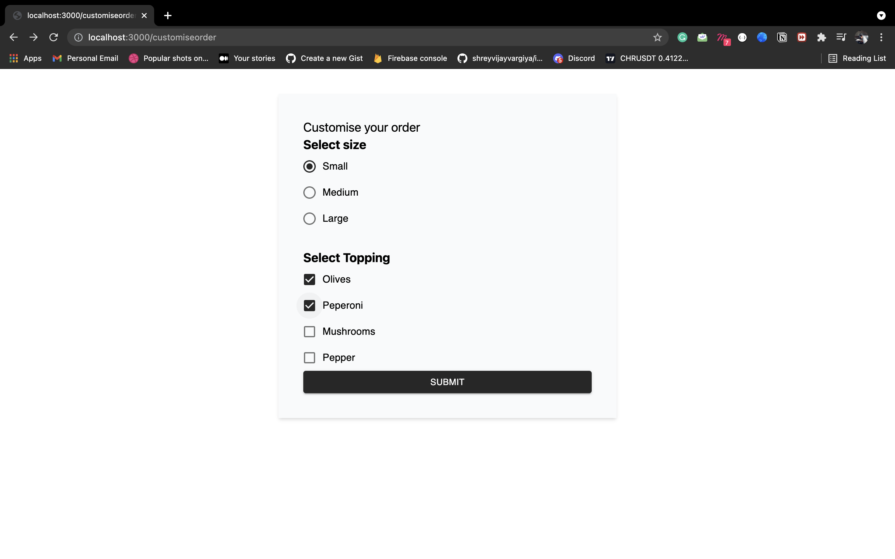
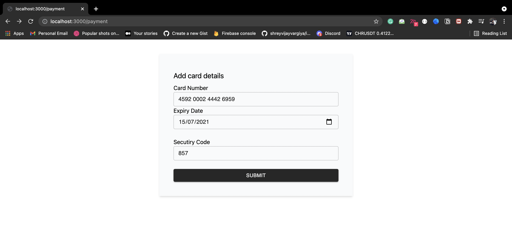
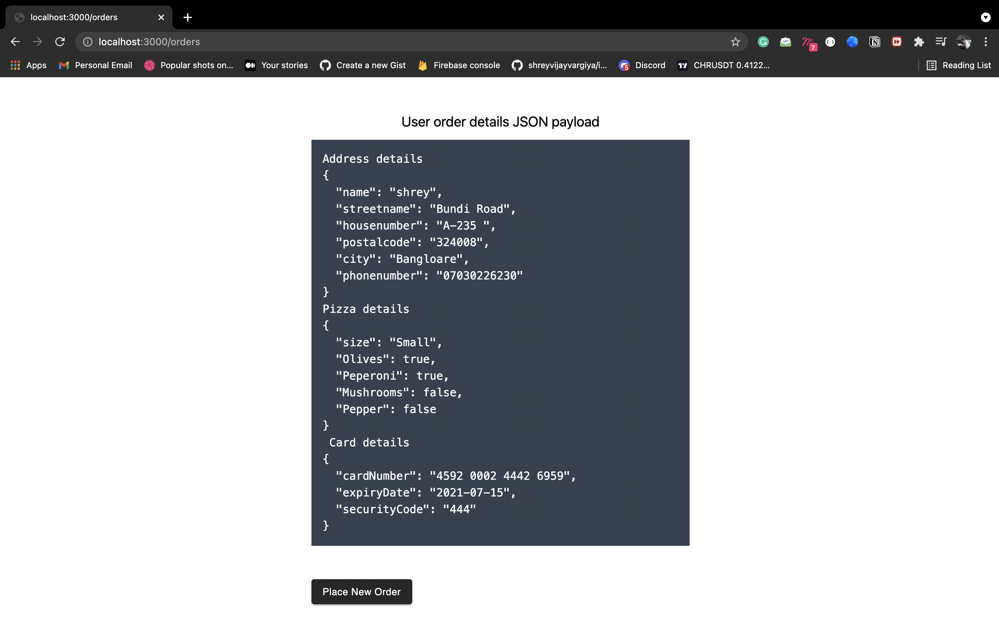

<h1>Realtime Customise Pizza Ordering Application</h1>
<h2>Arive Project</h2>

<ol>
  <li>
  User has to fill address to place order initially
</li>
<li>After filling address user can customise the pizza he/she wants to order</li>
<li>Followed by adding card details</li>
<li>Final details of the user address, pizza order and card information is shown in JSON object</li>
</ol>

<h4>Final order details</h4>
<p>Final Order details are stored in redux store can can be retrived as paylaod to send to the API using POST method.</p>

<h4>Dependencies</h4>
<ol>
  <li>Next JS - Framework</li>
  <li>Tailwind CSS - CSS Styling</li>
  <li>Material UI - UI library</li>
  <li>Card-Validator - Card number validation</li>
  <li>Input Mask - For masking the card numebr and security code number</li>
</ol>

<h4>Hosted link</h4>
<a href="https://arive-project.vercel.app/" target="_blank">Click the link to reach the hosted url</a>

<h4>How to run</h4>
 
 ```
  $ git clone
  $ yarn
  $ yarn run dev
  $ open localhost:300
 ```
<br />
<br />
<br />

<h4>References via screenshot</h4>
<p>Address Screen</p>


<p>Pizza Customise Screen Screen</p>


<p>Pizza Customise Screen Screen</p>


<p>Payment Screen</p>


<p>Orders Screen</p>


